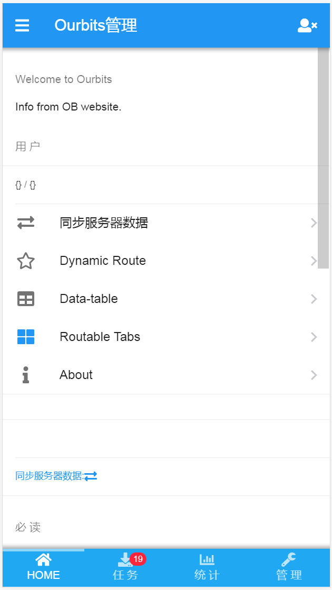
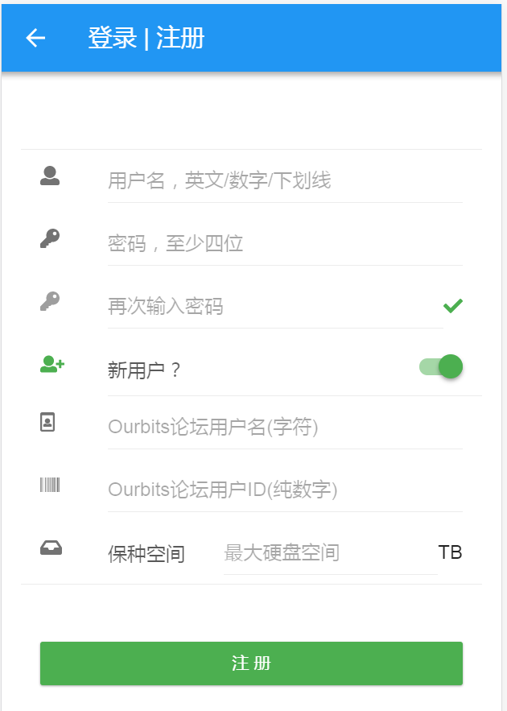
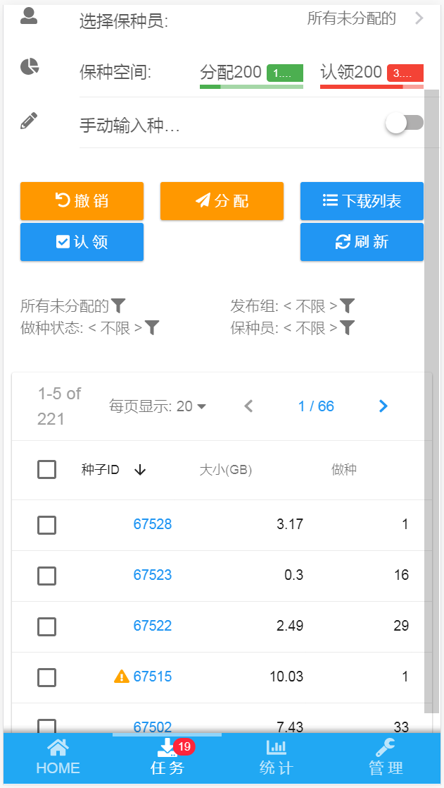

# framework7-vue data-table demo

> under construction!
> re-design of https://ourbits.herokuapp.com
data-table for framework7 and vue, support sorting, http get api, pagination etc.

## Homepage
Including: navbar, tabs, side-pannel
- use routable Tabs, easily loading component pages
- hide navbar on-scroll, expand view on mobile

Live Demo: https://ourbits.herokuapp.com/v2

## Login
Including: login, register, validation
- listen keypress event, Enter key to login

## Data view
Including: data-table, smart-select, popover, pagination
- header shows selected rows information, total size
- header is sortable
- pagination: prev, forward button. directly select page number
- action button on selection

